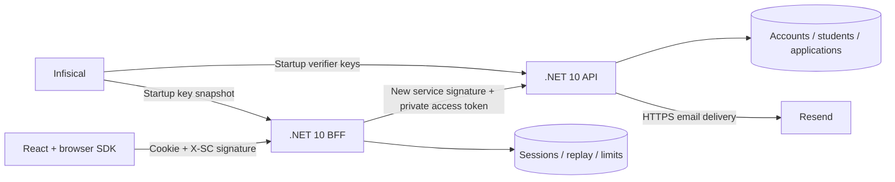
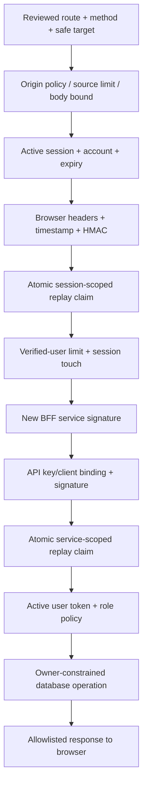

# Architecture and security contract

## Trust boundaries



The SDK executes inside the browser. It is not a network hop. The BFF serves the built React app, so API calls share its origin. Backend API URLs are selected by trusted configuration, never by caller input. Free hosting packages the BFF and API as separate processes in one container. This is a process boundary but not strong host/identity isolation. The API binds to loopback. Paid production can run separately under distinct identities over private TLS.

## Exact signing formats

Browser canonical string, UTF-8, LF separators and no final LF:

```text
METHOD
/api-proxy/actual/path
TIMESTAMP_IN_MILLISECONDS
REQUEST_UUID
main
LOWERCASE_HEX_SHA256_OF_EXACT_BODY_BYTES
```

`X-SC-Signature = Base64(HMAC-SHA256(sessionBrowserKey, canonical))`.

Empty requests hash zero bytes. JSON is serialized once, hashed, and sent unchanged. Query strings, encoded/ambiguous paths and bodies on GET are rejected. Browser keys are 32 random bytes and readable by JavaScript during context establishment. They provide a per-session protocol check; they do not prove the UI is genuine or defeat XSS/users controlling their own browser.

API canonical string:

```text
sc-service-v2
METHOD
/api/actual/path
NEW_TIMESTAMP_IN_MILLISECONDS
NEW_REQUEST_UUID
sc-bff-main
LOWERCASE_HEX_SHA256_OF_EXACT_BODY_BYTES
LOWERCASE_HEX_SHA256_OF_EXACT_AUTHORIZATION_HEADER
```

The additional prefix and Authorization hash intentionally extend the original plan. This binds the backend user token to the service signature. Authentication endpoints use the hash of an empty Authorization string. Both implementation ends require `X-Signature-Version: 2`; do not connect a legacy six-line API verifier to this BFF without coordinated version migration.

The service key ID selects a verifier key; the key must also be bound to the supplied client ID. The BFF generates a fresh request ID and signature. Browser-supplied service headers, cookies, URLs and access tokens are never forwarded.

## Verification order



Signatures compare decoded 32-byte values with constant-time equality. Timestamps allow ±5 minutes. Replay IDs live for 10 minutes after acceptance and are claimed using a unique SQL insert, never a read-then-write race. Browser replay scope is the actual session hash. Service scope is the authenticated client identity. Required database failures stop requests; no in-memory fallback is used.

POST login/register/verify/forgot/reset and local session-context recovery require exact configured Origin. They are the only browser-signature exceptions. API authentication endpoints still require the BFF service signature. CORS is not enabled. Unsafe writes require Origin plus the authenticated request signature; cookies are SameSite=Strict. The hosted cookie is `__Host-sc_session_main`, Secure, HttpOnly, Path=/, with no Domain. Local HTTP uses explicitly separate `sc_dev_session` cookies on loopback only.

## Identity and sessions

Passwords use ASP.NET Core Identity's salted PBKDF2 format with 210,000 iterations. Registration accepts only an email address and sends a single-use link. The email owner chooses their name and password after opening the link. An unverified registration therefore cannot set a known final password for someone else's address. No password appears in URLs or logs.

The API issues opaque random 256-bit access tokens, storing only SHA-256 hashes, with 8-hour maximum lifetime. The BFF stores the token and browser key in an AES-256-GCM encrypted session payload bound to the hashed session ID as associated data. API keyrings do not need the BFF session encryption key. Cookie identifiers and action links are stored hashed. Sessions have a 30-minute idle limit and an 8-hour absolute limit. Only verified requests/context recovery renew idle time. Logout revokes its API token and session. Password reset revokes all tokens/sessions and outstanding reset links. Disabled accounts fail API and BFF checks on each request. There is no silent refresh-token flow.

Signing keyrings are immutable startup snapshots. Failed secret retrieval prevents startup; an already running process keeps its loaded keys. Rotation/revocation therefore requires coordinated restarts. Browser context is tab memory only; the SDK uses same-origin POST recovery after reload. No localStorage bearer token or cookie compatibility bearer marker is used.

## Authorization and writes

Parent registration cannot set a role. New student profiles are owned by the authenticated account, not by a submitted owner ID. Reads constrain ownership in SQL and return 404 for absent or invisible records. This does not establish a real-world parent relationship to an imported student: that workflow is not provided.

Each deployment represents one organization. Staff are granted access by an operator command after account verification, with session revocation and an audit entry. Staff review all applications in this organization. Do not share this deployment across unrelated districts; introduce tenant keys and tenant-scoped staff assignments first.

Application submission uses a caller-generated submission UUID plus an exact request fingerprint. Same ID/same bytes returns the stored result; different content conflicts. A unique user/student/school/year constraint also stops duplicate submissions with new request IDs. Decisions require staff role, `Submitted` state and matching version in an atomic update. State change and audit commit in one transaction. No payment or charge endpoint exists.

## Errors and operating bounds

All application errors use `{ type, title, status, code, traceId }` with `application/problem+json`. Trace IDs are server generated. APIs use independent trace IDs; the BFF sends its trace as a diagnostic header but neither uses it for authority. Server logs exclude cookies, signatures, bodies, passwords and tokens.

| Condition | Browser response |
|---|---|
| Missing/expired session | 401 SESSION_REQUIRED / SESSION_EXPIRED |
| Wrong credentials or unverified account | 401 INVALID_CREDENTIALS |
| Bad browser HMAC, stale timestamp or replay | 403 SIGNATURE_INVALID / TIMESTAMP_SKEW / REPLAY_DETECTED |
| Wrong origin | 403 CSRF_ORIGIN |
| No action permission | 403 ACCESS_DENIED |
| Missing/invisible record | 404 RECORD_NOT_FOUND |
| Duplicate application / stale decision | 409 APPLICATION_ALREADY_EXISTS / VERSION_CONFLICT |
| Rate limit | 429 RATE_LIMITED, Retry-After: 60 |
| API service-signature failure | 502 BFF_SERVICE_AUTH_FAILED; keep user session |
| Invalid upstream type/DTO/size | 502 UPSTREAM_RESPONSE_INVALID |
| Required state unavailable | 503 SECURITY_STATE_UNAVAILABLE / SERVICE_UNAVAILABLE |
| Upstream/overall deadline | 504 UPSTREAM_TIMEOUT |

Requests are limited to 32 KiB; upstream responses to 64 KiB. SQL commands use a 3-second command budget, API calls 8 seconds, requests 10 seconds, browser calls 15 seconds. Configure connection timeouts separately. Shared limits cover sources, verified users, auth sources and account login/reset attempts. Fixed windows are intentionally simple and allow boundary bursts. Login failures are generic; email delivery timing may still reveal account existence, so strict anti-enumeration requires asynchronous outbox delivery.

Forwarded headers are not trusted automatically. Behind Render the IP bucket may represent the shared proxy, which is conservative but may throttle many users together. Configure a verified ingress identity/forwarding policy and retune limits before broad rollout. Do not trust arbitrary X-Forwarded-For.

Lists are capped at 100 rows to bound output; multi-page administration is a tracked release extension. Cleanup removes expired state in batches. Audit records are retained until an approved retention job is configured.
